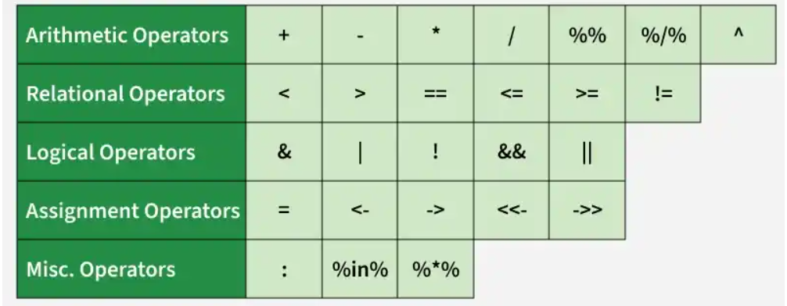
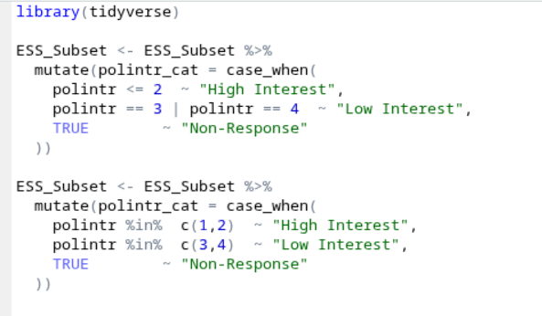
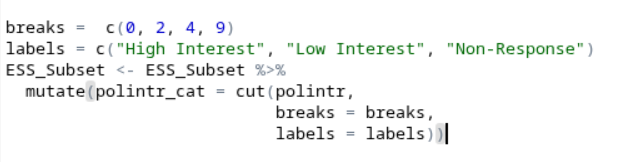

# Exercise 3

## Recap

In the first and second R sessions, we covered the following:

::::::: row
:::::: col-sm-6
::::: {.card .border-primary .mb-3 style="max-width: 30rem;"}
::: card-header
Exercise 1 and 2 Tasks
:::

::: {.card-body .text-primary}
<p class="card-text">

T1: Downloading and Loading ESS Subset on R. ✅<br> 
T2: Introduction to Key Commands ✅ <br> 
T3: Plotting Variable Distributions ✅<br> 
T4: Cross Country and Mode Comparision ✅<br>
T5: Splitting Variable of Choice ✅ 
</p>
:::
:::::
::::::
:::::::

# Recap Exercise

For this exercise, we have some R cheat sheets and a BINGO! But first, a recap exercise, so we do not forget what we did in the last two sessions!  

- Load the ESS subset dataset into your environment  
- Confirm that the dataset is available  
- View the dataset  
- Check its dimensions  
- Look at the column names  
- Explore any two variable using basic summaries  
- Create a quick distribution plot for any variable 
- Compare political interest across countries; look at both counts and proportions  
- Choose another variable and split it into two groups
- Compare another variable across these groups  


## Cheat Sheets and Bingo!

These cheat sheets help list various data transformations and tidying your environment code syntax without needing to memorize every single function argument:

* [Data Transformation with dplyr](https://opensource.posit.co/resources/cheatsheets/data-transformation/)
* [Data Tidying with tidyr](https://opensource.posit.co/resources/cheatsheets/tidyr/)

## Splitting variable (``mutate() & cut()``)

::: {.panel-tabset}

### Piping + Operators

From [Pipe in R: A Guide](https://builtin.com/articles/pipe-in-r#:~:text=The%20pipe%20operator%2C%20formerly%20written,a%20sequence%20of%20analysis%20steps.)

The pipe operator, formerly written as %>%, was a longstanding feature of the magrittr package for R. The new version, written as |>, is largely the same. It takes the output of one function and passes it into another function as an argument. This allows us to link a sequence of analysis steps.

To visualize this process, imagine a factory with different machines placed along a conveyor belt. Each machine is a function that performs a stage of our analysis, like filtering or transforming data. The pipe works like a conveyor belt, transporting the output of one machine to another for further processing.

The pipe is best understood as the word **"then"**, allowing us to read code like a sentence. We will use it here to select our specific variables and filter out a country.

To look at how it works be can check an example from the ``ESS_Subset``, using a popular set of commands. 

```{r,echo=F, message=FALSE}
library(readr)
ESS_Subset <- read_csv("ESS_Subset.csv")
```


```{r, warning=F, message=FALSE}
library(tidyverse)
DE_Subset <- ESS_Subset %>%
  select(cntry, agea, gndr, eduyrs, polintr, lrscale) %>%
  filter(cntry == "DE") 
```

Let us also look at [R Operators: www.geeksforgeeks.org](
https://www.geeksforgeeks.org/r-language/r-operators/)



### Use case + Documentation

- Using ``ifelse()``

The `ifelse()` function is the quick way to split data. It can get quite messy in many cases. It works by evaluating a logical condition and returning one value if TRUE and another if FALSE. To handle multiple splits, you will have to "nest" the functions.

- Using tidyverse with `mutate()` and `case_when()`

Using tidyverse is cleaner and easy to read. `case_when()` is the cleaner, more powerful version of `ifelse()`. It allows you to list multiple conditions sequentially without nesting!

Here is an example: 

- Using `cut()`

The `cut()` function is specifically designed for converting numeric vectors into factors by cutting them into intervals. This is often the best way to split the data which is separated into equal/unequal but consistant intervals.

Here is an example: 

### When 

Use ``mutate()`` whenever you need to add a new column to your dataset without changing the original variables. Use ``case_when()`` for complex logic (if/then) and ``cut()`` when you specifically want to create "buckets" or bins from numeric ranges.


###  How

Inside a pipe, call ``mutate(new_column_name = calculation/logic)``. Within that, use ``case_when()`` to map specific values or ``cut()`` to define breaks and labels for numeric intervals.

### ESS Example

```{r}
ESS_Subset <- ESS_Subset %>%
  mutate(gender_label = case_when(
    gndr == 1 ~ "Male",
    gndr == 2 ~ "Female",
    TRUE      ~ NA_character_  
  ))
```


```{r}
ESS_Subset <- ESS_Subset %>%
  mutate(age_group = cut(agea, 
                         breaks = c(0, 30, 60, 120), 
                         labels = c("Young", "Middle", "Senior")))
```


:::

## Sub-populations (``filter()``)

::: {.panel-tabset}

### Use case + Documentation

**Use Case**: Narrowing your focus. In the ESS, this is most commonly used to select specific countries for comparison or to "clean" the data by removing non-response codes (77, 88, 99) before doing math. ``filter()`` is one of the most commonly used functions prior to further aggregations. 


### When 

Use ``filter()`` at the beginning of your analysis to remove observations that aren't relevant to your research question, or to isolate specific groups

###  How

Provide a logical condition inside the function, such as ``==`` (equal to), ``!=`` (not equal to), ``>`` (greater than), or ``%in%`` (contained within a list)

### ESS Example

```{r}
#Simple ESS Example
# Filtering only Germany

df_de <- ESS_Subset %>% filter(cntry == "DE")
```

```{r}
# Nuanced ESS examples
# Filtering young people who are highly interested in politics

df_active_youth <- ESS_Subset %>% 
  filter(agea < 30, polintr <= 2)

```

When we mant to filter out multiple specific values without writing ten ``==``statements

```{r}
# Filter for 2  countries of interest
target_countries <- c("DE","SE")
ESS_2country <- ESS_Subset %>% 
  filter(cntry %in% target_countries)

# Filtering for specific countries AND valid answers (Excluding 7, 8, and 9 from the polintr variable)
df_clean <- ESS_Subset %>%
  filter(cntry %in% c("DE", "SE"),
         !polintr %in% c(7, 8, 9))
```

:::


## Combining Datasets (``merge()``)

::: {.panel-tabset}

### Use case + Documentation

**Use Case**: Enriching your data. In social sciences, we often merge different types of datasets to enrich our findings. For example, we can merge individual-level survey data (ESS) with country-level context (like Gapminder's GDP or World Bank data) to see how national environments affect individual behavior :) 

### When 

Use ``left_join()`` (the tidyverse version of ``merge()``) when you have two separate tables that share a common ``"key"`` variable (for example ``cntry`` in one of our examples) and, you want to bring them together into one wide dataframe.

###  How

``data_a %>% left_join(data_b, by = "common_column")``. The "left" join ensures you keep all rows from your primary dataset.

### ESS Example

```{r}
#Simple ESS Example
# Sometimes it is possible to merge two datasets as well! In this example let us add the full names of the country using merge

# Note: This is a simple merge example, it is better to use mutate when basically adding new columns like this! 

# First check what are the countries we have
table(ESS_Subset$cntry)

# Next, make a df we want to merge, many times we already have it! 
country_names <- tibble(cntry = c("DE", "HU", "SE"), full_name = c("Germany", "Hungary", "Sweden"))


df_joined <- ESS_Subset %>% left_join(country_names, by = "cntry")

```


```{r}
# Nuanced ESS example
# What if there was another dataset we can merge this data with! 
# *This is just an example

library(gapminder)

# gapminder has full country names, so we also add those!
merge_help <- tibble(cntry = c("DE", "HU", "SE"), 
                 country = c("Germany", "Hungary", "Sweden"))

ess_with_names <- ESS_Subset %>% left_join(merge_help, by = "cntry")

# since we do not want the combinated dataset to explode, lets filter for only one year, in this data the latest is 2007. 
gap_filtered <- gapminder %>% filter(year == 2007)
combined_data <- ess_with_names %>% left_join(gap_filtered, by = "country")

```

:::


## Aggregations (``group_by()``)


::: {.panel-tabset}


### Use case + Documentation

**Use Case**: Moving from individuals to groups. Instead of looking at all the respondent individually, you might want to see the different group based scores for each country. This is the foundation of most descriptive tables in research.

### When 
Whenever you need a "summary" statistic (mean, median, count) for different categories rather than the whole dataset.

###  How

Always use ``group_by()`` and ``summarize()`` together. ``group_by()`` sets the "buckets," and ``summarize()`` performs the calculation (like ``mean()`` or ``n()``) inside each bucket.

### ESS Example

```{r}
#Simple ESS Example
ESS_Subset %>% 
  group_by(gndr) %>% 
  summarize(mean_age = mean(agea, na.rm = TRUE))

```

```{r}
# Nuanced ESS examples

trust_summary <- ESS_Subset %>%
  group_by(cntry) %>%
  summarize(
    avg_trust_police = mean(trstplc, na.rm = TRUE),
    respondents = n()
  )
```

:::

## Reshaping data (``pivot_long() & pivot_wider()``)

::: {.panel-tabset}


### Use case + Documentation

**Use case**: Getting data into the right "shape." 

```{r}
# Let us understand this using gapminder. 
gap_wide <- gapminder %>%
  filter(country %in% c("Germany", "Hungary", "Sweden"), 
         year %in% c(1997, 2002, 2007)) %>%
  select(country, year, gdpPercap) %>%
  pivot_wider(names_from = year, values_from = gdpPercap)

# helpful for ggplot!
gap_long <- gap_wide %>%
  pivot_longer(cols = `1997`:`2007`, 
               names_to = "year", 
               values_to = "gdp")

```


### When 

Use ``pivot_longer()`` when you have multiple columns (like trust_police, trust_parl etc.) and you would want like to turn them into a single "Type" column for easier plotting. Use ``pivot_wider()`` when you want to create a clean summary table for a report. However, the type and use cases depend mainly on the specific use cases! 

###  How

``pivot_longer(cols = columns_to_move, names_to = "new_label_col", values_to = "new_value_col")``

### ESS Example

```{r}
# Without Pivot
trust_comparison_nopiv <- ESS_Subset %>%
  group_by(cntry) %>%
  summarize(
    Police = mean(trstplc, na.rm = TRUE),
    Parliament = mean(trstprl, na.rm = TRUE)
  ) 

# With Pivot
# Pivoting helps with making cleaner tables and ggplot graphs! 
trust_comparison_piv <- ESS_Subset %>%
  group_by(cntry) %>%
  summarize(
    Police = mean(trstplc, na.rm = TRUE),
    Parliament = mean(trstprl, na.rm = TRUE)
  ) %>%
  pivot_longer(
    cols = c(Police, Parliament), 
    names_to = "Institution", 
    values_to = "Avg_Trust_Score"
  )

```


:::


## Transformations (``a  <- b +c``)

::: {.panel-tabset}


### Use case + Documentation

**Use case**: Constructing indices. We often average several related questions (like three questions on immigration) to create a more reliable "Index" or "Scale."


### When 
When you need to perform math across columns (row-wise) to create a total score or a mean score for a respondent.

###  How
``Use mutate()`` and standard math symbols (``+``, ``-``, ``/``, ``*``). For averaging multiple columns while handling missing data, ``rowMeans()`` is the standard tool.

Transformation code can be:

- addition: A <- B + C
- subtraction: A <- B - C
- division: A <- B / C
- multiplication: A <- B * C
- power: A <- B^2


Common statistical functions:

- minimum value: MIN <- ``min(A)``
- maximum value: MAX <- ``max(A)``
- absolute value: A <- ``abs(A)``
- sum: SUM_A <- ``sum(A)``
- mean: mean_A <- ``mean(A)``
- square root: X <- ``sqrt(A)``
- exponential: X <- ``exp(A)``
- natural logarithm: X <- ``log(A)``

### ESS Example
```{r}
#Simple ESS Example
ESS_Subset <- ESS_Subset %>% 
  mutate(total_society = trstplc + trstprl)
```

```{r}
# Nuanced ESS examples
ESS_Subset <- ESS_Subset %>%
  filter(imwbcnt <= 10, 
         imueclt <= 10, 
         imbgeco <= 10) %>% 
  mutate(immig_index = rowMeans(
    select(., imwbcnt, imueclt, imbgeco), 
    na.rm = FALSE 
  ))
```


:::


## Regressions (``lm() & glm()``)

::: {.panel-tabset}


### Use case + Documentation


### When 


###  How

### ESS Example

Linear Regression: 
```{r}
library(stargazer)

# Preparing the Regression Data
# We ensure variables are numeric and filter out NAs (including the ESS 77, 88, 99 codes)
reg_data <- ESS_Subset %>%
  mutate(
    trust_parl = as.numeric(trstprl),
    age        = as.numeric(agea),
    edu        = as.numeric(eduyrs),
    pol_int    = as.numeric(polintr)
  ) %>%
  filter(
    trust_parl <= 10, # Removes 77, 88, 99
    pol_int    <= 4,  # Valid range 
    !is.na(trust_parl),
    !is.na(age),
    !is.na(edu),
    !is.na(pol_int),
    !is.na(gndr)
  )

# Testing does age predict trust
fit1 <- lm(trust_parl ~ age, data = reg_data)

# Adding education and political interest
fit2 <- lm(trust_parl ~ age + edu + pol_int, data = reg_data)

# 3. Create the Table
stargazer(
  fit1, fit2,
  type = "text",
  title = "Table 1: Predictors of Trust in Parliament",
  covariate.labels = c("Age", "Years of Education", "Political Interest")
)
```
Logistic Regression

```{r}

```


:::


## Full Analysis Pipeline


