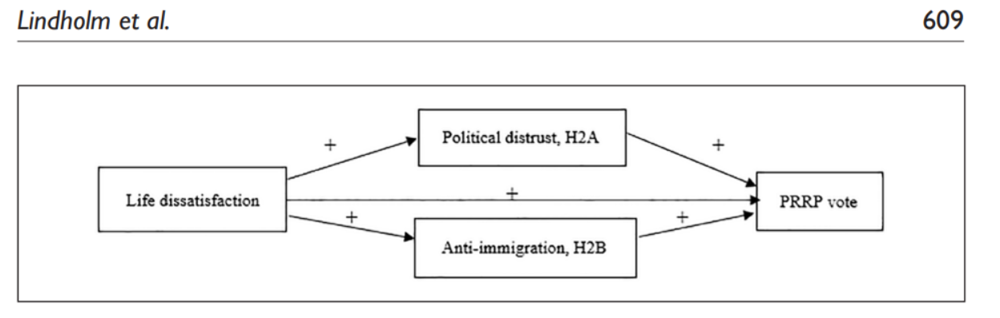

# Exercise 5

## Recap

Hopefully the Data Workshops were helpful! To recap, let us go through the independent tasks shared last week (It is not required to write code now, these are only for discussion and reflection). Do you how to solve these?

:::::: col-sm-6
::::: {.card .border-primary .mb-3 style="max-width: 50rem;"}
::: card-header
Independent Work
:::

::: {.card-body .text-primary}
<p class="card-text">

IT1: Create a new environment to fight the fear of starting on a blank slate (make sure to save your code beforehand!). Start writing your code in an .Rmd or .R file.

IT2: Look at the ESS Data Portal, choose relevant variables, and load the data into your R environment. Load the tidyverse package into the environment as well.

IT3: Practice key commands such as glimpse(), table(), prop.table(), and using the \$ operator.

IT4: Look at the summaries of some variables you are interested in. Refer to the ESS codebook for more information on the variables as well.

IT5: Make a quick, simple plot of any variable you are interested in (eg, a bar graph, density plot, etc.).

IT6: Using table(), unique(), or summary(), check if the variable has any strange survey codes (eg, 77, 88, etc.).

IT7: Splitting Variables: Use mutate() and case_when() to create a categorical text variable.

IT8: Numeric Bins: Split the age variable into different categories using cut().

IT9: Filtering Data: Isolate specific countries and remove non-response survey codes (eg, 77, 88) using filter().

IT10: Filtering Data: Use %in% to filter for specific countries alongside valid survey answers.

IT11: Aggregations: Calculate group means using group_by() and summarize().

IT12: Transformations: Create an immigration index using rowMeans().

IT13: R BINGO: Complete all remaining squares on your R BINGO card. This will cover everything important in data wrangling!

IT14: Look at all 12 layers in Exercise 4 for ggplot. Try to replicate this.

IT15: Add small changes in different layers to check the differences and see what each function or number does (refer to the end of section 4.3.12 in the booklet for a guide on some changes you can make).

IT16: Adjust the layers according to your visualization idea (try different visualizations, for example, boxplots, heatmaps, etc.).

IT17: Work on section 4.5 of the booklet: Draw your own graph -\> make it in R!

IT18: Extra: Experiment with other libraries by adding a specific text in the graph using annotate(), try drawing a box or arrow to highlight particular parts of a visualization, or try testing ggpattern().

</p>
:::
:::::
::::::

## DAG Discussion: Life Satisfaction, Political Trust, Immigration and Voting

::::::: row
:::::: col-sm-6
::::: {.card .border-dark .mb-3 style="max-width: 40rem;"}
::: card-header
Exercise: Draw a DAG
:::

::: {.card-body .text-dark}
<p class="card-text">

<strong>When you analyze the relationship between life dissatisfaction and voting for populist radical right parties (PRRPs) in the ESS. You find a strong correlation. Then: </strong><br><br>

T1: **How to connect these nodes?** Life dissatisfaction, political distrust, anti-immigration sentiment, PRRP vote and other socio-demographic variables. ⬜<br> T2: **Are political distrust and anti-immigration sentiment confounders, mediators, or colliders?**. ⬜<br>

</p>
:::
:::::
::::::
:::::::

### Answer

::::: {.border .p-3 .rounded .bg-light}
**Enter Password:**

::: {.input-group .my-2 style="max-width: 300px;"}
<input type="password" id="pass" class="form-control" placeholder="Password"> <button class="btn btn-primary" onclick="check()">Submit</button>
:::

<p id="wrong" class="text-danger" style="display:none;">

Wrong password!

</p>

::: {#right .mt-3 style="display:none;"}
<p class="text-success fw-bold">

Answer:

</p>



<p>Lindholm, A., Lutz, G., & Green, E. G. (2025). Life dissatisfaction and the right-wing populist vote: Evidence from the European Social Survey. American Behavioral Scientist, 69(5), 604-624.</p>
:::
:::::

```{=html}
<script>
function check() {
  var input = document.getElementById("pass").value;
  if (input === "por2026") {
    document.getElementById("right").style.display = "block";
    document.getElementById("wrong").style.display = "none";
  } else {
    document.getElementById("right").style.display = "none";
    document.getElementById("wrong").style.display = "block";
  }
}
</script>
```

## DAG Discussion: Your Own Idea!

::::::: row
:::::: col-sm-6
::::: {.card .border-dark .mb-3 style="max-width: 40rem;"}
::: card-header
Exercise: Draw, Understand and Explain Your Own Idea!
:::

::: {.card-body .text-dark}
<p class="card-text">

<strong>If you plan to use survey responses for your master's thesis or final assignment, start by choosing your core topic. The goal for this exercise is to come up with a coherent research question/pick an existing research question you are working on and based on the existing literature, use public opinion data like the ESS, and map out your assumptions/hypothesis visually using a DAG to clarify the causal flow. Finally, we will bring it all together by testing your hypothesis and DAG workflow in R!</strong><br><br>

T1: Come up with a research question which can be answered using survey data. ⬜<br> T2: Draw a DAG to map out the causal pathways and control variables between your main concepts. ⬜<br> T3: Let us Discuss. ⬜<br>

</p>
:::
:::::
::::::
:::::::

## DAG Discussion: Key Themes and ESS Data

Important Links:

- Here is a link to the ["European Social Survey"](https://www.europeansocialsurvey.org/) homepage.

- You can read about the survey methodology, resources and news on ESS, on the link shared above. To check for different rounds of the ESS, data access, how data was collected for your country of interest, i.e., survey sampling strategy, refer to this link: [ESS Data](https://ess.sikt.no/en/series/321b06ad-1b98-4b7d-93ad-ca8a24e8788a) (This includes information for all ESS rounds).

- For more information of ESS Round 11, 2023, refer to this link: [ESS11](https://ess.sikt.no/en/study/412db4fe-c77a-4e98-8ea4-6c19007f551b/). For information on country documentation, click on the "Country Documentation" drop-down.

- For documentation on all the variables used in ESS Round 11, refer to this link [Variable Documentation](https://ess.sikt.no/en/datafile/242aaa39-3bbb-40f5-98bf-bfb1ce53d8ef) (you can also download the entire ESS Round 11 Dataset on this page but it is not recommended)

- "ESS Data Portal", which allows us to build our own custom dataset! [Link to Data Portal](https://ess.sikt.no/en/data-builder/).

::::::: row
:::::: col-sm-6
::::: {.card .border-dark .mb-3 style="max-width: 40rem;"}
::: card-header
Exercise: Suggest key themes you find Interesting!
:::

::: {.card-body .text-dark}
<p class="card-text">

<strong>Let us stop and think about some ESS relevant themes, which are interesting to us. Based on these themes, we will navigate the ESS Data Portal to select necessary variables, download the dataset start working towards answering our research question!</strong><br><br>

T1: We navigate the ESS Data Portal to select and download our variables.⬜<br> T2: Load, filter, and clean our dataset in R. ⬜<br> T3: Visualise as a table or graph!. ⬜<br> T4: Create a DAG to highlight the process ⬜

</p>
:::
:::::
::::::
:::::::
