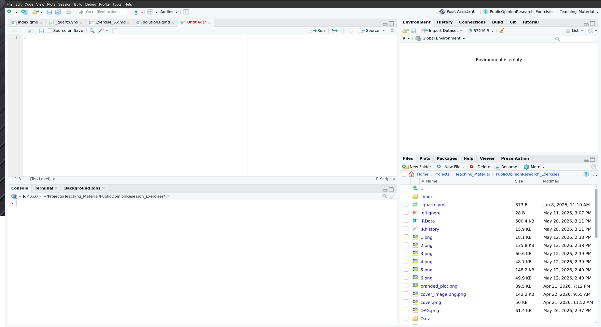
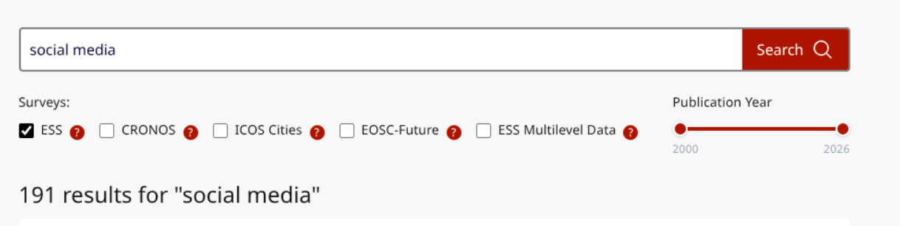

# Independant Task: Solutions

:::::: col-sm-6
::::: {.card .border-primary .mb-3 style="max-width: 50rem;"}
::: card-header
Independent Tasks: 1-4
:::

::: {.card-body .text-primary}

IT1: Create a new environment to fight the fear of starting on a blank slate (make sure to save your code beforehand!). Start writing your code in an .Rmd or .R file.

IT2: Look at the ESS Data Portal, choose relevant variables, and load the data into your R environment. Load the tidyverse package into the environment as well.

IT3: Practice key commands such as glimpse(), table(), prop.table(), and using the \$ operator.

IT4: Look at the summaries of some variables you are interested in. Refer to the ESS codebook for more information on the variables as well.

:::
:::::
::::::

## Solutions to Independant Tasks 1:4

**1. Starting from an empty .R file!** 

Let us start from an empty .R file. You can go to File -> New File -> R Script/R Markdown.

**2. Deciding Research Question and Loading Data**

Looking at the ESS Data Portal [Link to Data Portal](https://ess.sikt.no/en/data-builder/), I found these variables interesting and decided to work on these for the independant task solutions: 

Reading through the ESS Variables, I was interested in looking at if there were any social media relevant variables in the ESS Dataset. 

Using the search bar in the Portal, I looked for interesting variables relevant to social media and, found this variable: 

- **pstplonl** - Posted or shared anything about politics online last 12 months. (*Question: And still thinking about different ways of trying to improve things in [country] or help prevent things from going wrong, during the last 12 months, have you done any of the following? Have you... ...posted or shared anything about politics online, for example on blogs, via email or on social media such as Facebook or Twitter?*)

- **netustm** - Internet use, how much time on typical day, in minutes (*Question: Question: On a typical day, about how much time do you spend using the internet on a computer, tablet, smartphone or other device, whether for work or personal use?*)

With this, I thought it would be interesting to combine the "Institutional Trust" Variables and work on the independent tasks. 

- **Trust Variables** - This includes variables we have been working with, such as trstprl, trstlgl,trstplc etc. (*Question:Using this card, please tell me on a score of 0-10 how much you personally trust each of the institutions I read out. 0 means you do not trust an institution at all, and 10 means you have complete trust. Firstly... ...political parties?*)

These are the variables I downlaoded: [https://ess.sikt.no/en/data-builder/?rounds=11.1-3_9-11&seriesVersion=977&tab=variables&variables=0.2_3+1.0.47_51_57-64+3.1_62_88+4.0.56_74+9.28](https://ess.sikt.no/en/data-builder/?rounds=11.1-3_9-11&seriesVersion=977&tab=variables&variables=0.2_3+1.0.47_51_57-64+3.1_62_88+4.0.56_74+9.28)

This leads us to a simple research question: **"Does heavy internet use degrade institutional trust, and is this effect accelerated for people who actively post about politics online?"**

:::::: col-sm-6
::::: {.card .border-primary .mb-3 style="max-width: 50rem;"}
::: card-header
Independent Tasks: 5-
:::

::: {.card-body .text-primary}

:::
:::::
::::::

